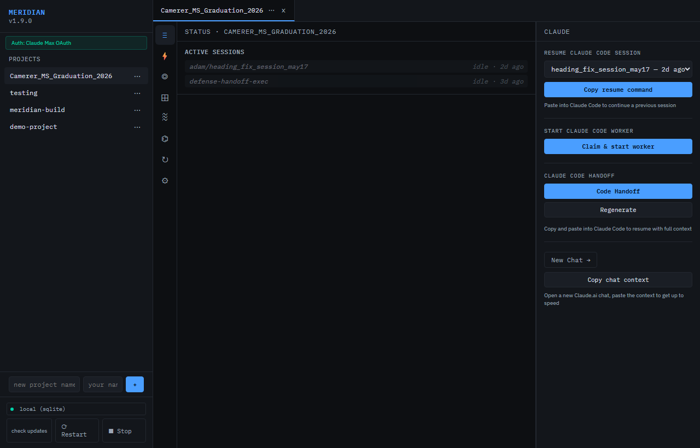
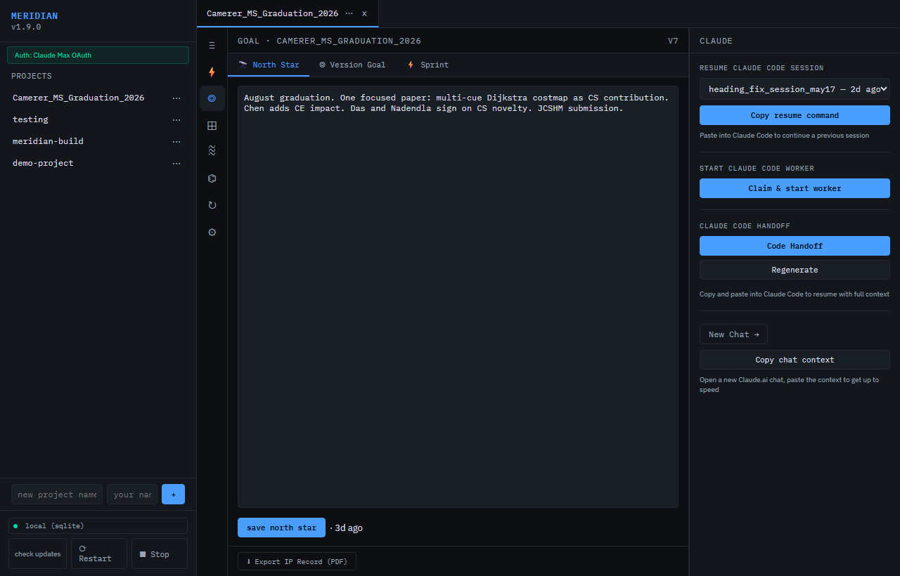
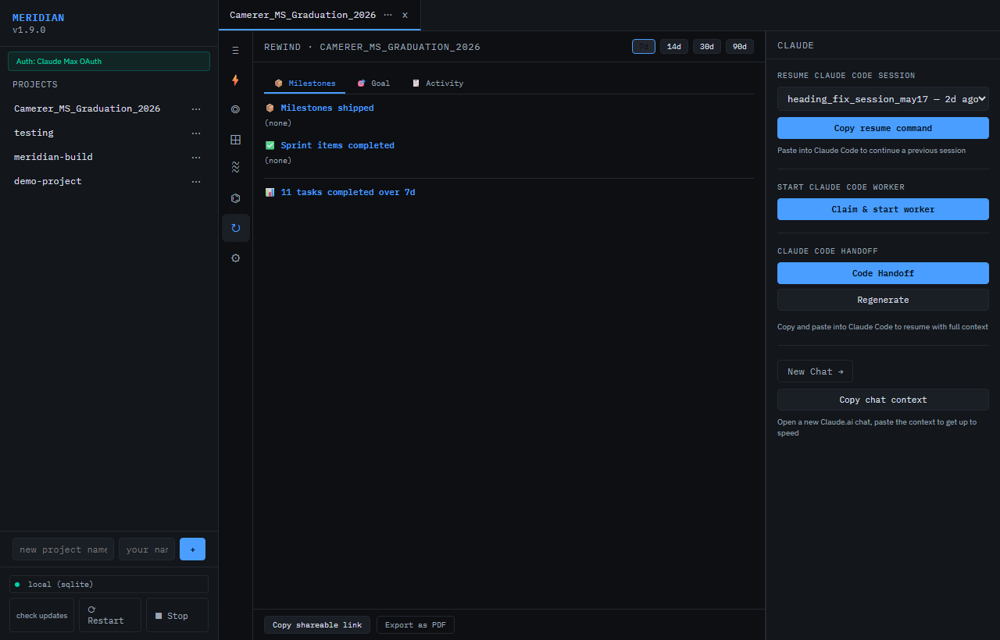

# Meridian

[](LICENSE)

Your AI sessions don't remember each other.

Every Claude tab starts fresh. Parallel sessions duplicate work. Context fills up
and you lose everything. Meridian fixes this — a local server every session connects
to so they share goal state, see each other's task logs, and can resume instantly
from a compressed handoff.

## Screenshots







## What you get

- **Dashboard** at `http://localhost:7878` — live sessions, task queue, sprint board,
  goal state, rewind timeline
- **MCP tools** for Claude: `start_session`, `log_task`, `generate_handoff`, `claim_task`
- **SQLite** by default; swap in Postgres for teams sharing one brain
- Works with **Claude Code, Claude Desktop, Cursor, Windsurf**

## Install

### Option A — single executable (Windows, no Python required)

Download `meridian.exe` from [Releases](https://github.com/ajc3xc/Meridian/releases).
Double-click. Dashboard opens at `http://localhost:7878`.

### Option B — Docker (no Python required)

```bash
git clone https://github.com/ajc3xc/Meridian
cd Meridian
docker compose up
```

Dashboard at `http://localhost:7878`. Data persists in `./data/`.

### Option C — from source (all platforms)

```bash
# Requires pixi — https://prefix.dev
git clone https://github.com/ajc3xc/Meridian
cd Meridian
pixi run start       # dashboard at http://localhost:7878
```

## Connect to Claude

### Claude Code (recommended)

Create `.mcp.json` in your project root:

```json
{
  "mcpServers": {
    "meridian": {
      "command": "pixi",
      "args": ["run", "python", "-m", "meridian", "--mcp"],
      "cwd": "/absolute/path/to/Meridian"
    }
  }
}
```

Every Claude Code session in that project gets Meridian tools automatically.

### Claude Desktop

Add to your Claude Desktop config:

- Windows: `%APPDATA%\Claude\claude_desktop_config.json`
- macOS: `~/Library/Application Support/Claude/claude_desktop_config.json`

```json
{
  "mcpServers": {
    "meridian": {
      "command": "pixi",
      "args": ["run", "python", "-m", "meridian", "--mcp"],
      "cwd": "/absolute/path/to/Meridian"
    }
  }
}
```

Restart Claude Desktop. Your next chat has Meridian tools available.

## Team coordination

Set `MERIDIAN_DB_URL=postgresql://...` and each person runs Meridian locally
against a shared Postgres database. Everyone's sessions share the same goal state
and task log. No Meridian server needed in the cloud.

## How it works

1. `start_session(project_id=..., session_name="my-session")` — returns
   the current goal, recent task log, and active sprint in one call
2. Do work: `log_task(..., description="built auth endpoint", status="done")`
3. Before context fills: `generate_handoff(project_id=...)` — a new session
   reads this file and picks up exactly where you left off
4. Parallel sessions: `claim_task` atomically locks a work item —
   no duplicated effort, no stepping on each other

State lives in a local SQLite file. No accounts, no cloud, no sync required.

## Hosted tier

Zero-install dashboard at [usemeridian.us](https://usemeridian.us) — your team
gets a shared URL, Google login, and a dedicated Postgres database. No Python
required anywhere.

Once you have an account, add this to your Claude Code `.mcp.json`:

```json
{
  "mcpServers": {
    "meridian": {
      "command": "npx",
      "args": ["-y", "mcp-remote", "https://usemeridian.us/mcp"],
      "env": {"BEARER_TOKEN": "sk_meridian_your_token_here"}
    }
  }
}
```

[Join the waitlist](https://usemeridian.us#waitlist) or email
[hello@usemeridian.us](mailto:hello@usemeridian.us).

## Contributors

[](https://github.com/ajc3xc/Meridian/graphs/contributors)

## License

[MSL-2.0](LICENSE) — free for local and internal use, any team size. Paid for hosting as a service to others. See LICENSE for details.

For licensing questions: hello@usemeridian.us
