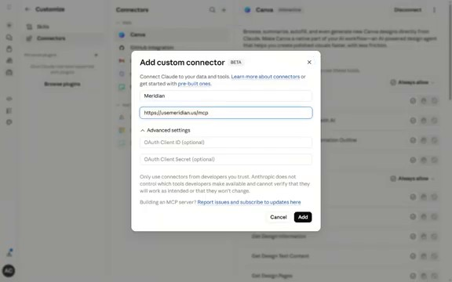
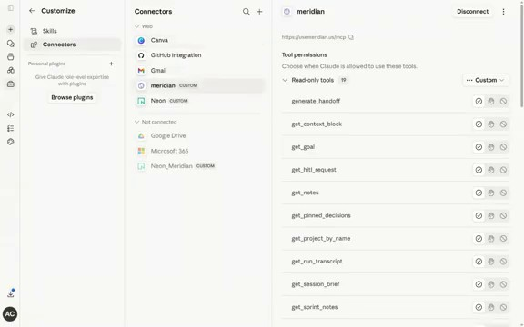
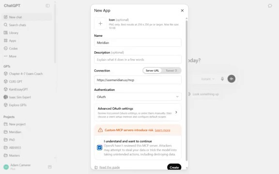
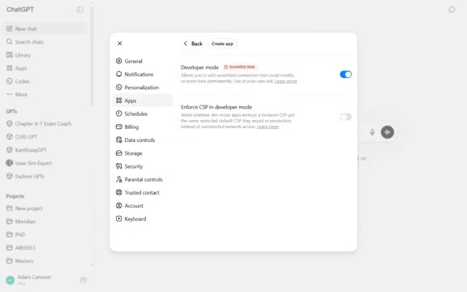

# Browser Connector

Use Meridian from browser-based AI clients without giving up the shared session
memory, sprint board, or HITL queue.

- **Claude** can connect directly to hosted Meridian with a remote MCP connector.
- **ChatGPT** now surfaces these integrations under **Settings > Apps**.
- **Self-hosted localhost** setups still need a bridge or a public URL.

---

## Hosted browser clients

Hosted Meridian is the simplest path for both Claude and ChatGPT:

1. Sign in to [usemeridian.us](https://usemeridian.us).
2. Add Meridian with the public MCP URL: `https://usemeridian.us/mcp`
3. Approve the OAuth popup.
4. Start using Meridian tools in chat.

### Claude

In Claude, go to **Customize > Connectors** (or **Settings > Connectors** in
some layouts), choose **Add custom connector**, then paste:

- **Name:** `Meridian`
- **URL:** `https://usemeridian.us/mcp`


*Claude custom connector modal with the hosted Meridian MCP URL prefilled.*


*Claude showing Meridian connected and exposing the shared-session toolset.*

#### Claude video walkthrough

<iframe width="100%" height="400" src="https://www.youtube.com/embed/dxX1Nwi72lI" frameborder="0" allowfullscreen></iframe>

### ChatGPT

In ChatGPT, open **Settings > Apps**, choose **New App**, then add Meridian's
public MCP endpoint:

- **Name:** `Meridian`
- **Server URL:** `https://usemeridian.us/mcp`


*ChatGPT's "New App" flow pointed at the hosted Meridian MCP endpoint.*


*ChatGPT with Meridian connected under Settings > Apps.*

#### ChatGPT video walkthrough

<iframe width="100%" height="400" src="https://www.youtube.com/embed/U5pUUpOy5H4" frameborder="0" allowfullscreen></iframe>

!!! note "Current ChatGPT naming"
    OpenAI now calls these integrations **Apps**. Older docs and screenshots may
    still say "connectors" or "custom connectors", but the Meridian MCP URL is
    still the same: `https://usemeridian.us/mcp`.

---

## Self-hosted local browser clients

Hosted browser clients talk to a public MCP endpoint. If you are running
Meridian on `localhost`, you have two paths:

- **Claude + Chrome/Chromium:** use a local SSE bridge.
- **Claude or ChatGPT with remote MCP:** expose Meridian on a public HTTPS URL
  and use `/mcp`.

<details>
<summary>Self-hosted only: local Claude bridge for localhost</summary>

1. Start Meridian locally:

```bash
pixi run start
# or: python -m meridian
```

2. Install a browser bridge such as
   [dnakov/claude-mcp](https://github.com/dnakov/claude-mcp).
3. Add your local SSE endpoint:

   - **Name:** `Meridian (local)`
   - **URL:** `http://localhost:7878/mcp/sse`

4. Open Claude and enable the connector for the conversation.

</details>

!!! note "Public URL required for remote MCP"
    Claude remote custom connectors and ChatGPT custom apps do **not** connect
    directly to `http://localhost`. If you want browser clients to reach your
    self-hosted server without a local bridge, expose Meridian on HTTPS first
    and use `https://your-host/mcp`.

---

## Troubleshooting

**"No tools loaded" or the connector hangs**

- Make sure Meridian is running.
- For hosted, reconnect and confirm the URL is `https://usemeridian.us/mcp`.
- For self-hosted localhost bridges, confirm the extension points to
  `http://localhost:7878/mcp/sse`.
- For public self-hosted URLs, confirm `https://your-host/mcp` is reachable
  from outside your network.

**Auth popup does not close**

- Finish the Meridian OAuth flow, then return to Claude or ChatGPT.
- If it still hangs, disconnect Meridian and add it again.

**Tools appear but calls fail**

- For hosted, regenerate your API token if your account was recently reset.
- For self-hosted public URLs, verify your reverse proxy forwards `/mcp` cleanly.
- For localhost bridges, check the extension logs for 401 / 403 errors.

---

## What you get

Once connected, browser clients can call the same core Meridian tools as your
desktop agent:

| Tool | What it does |
|------|-------------|
| `start_session` | Load full project context in one call |
| `log_task` | Log what the session just did |
| `generate_handoff` | Create a resumable context file |
| `request_hitl` | Surface a blocking question to the dashboard |
| `get_sprint_items` | See the sprint board |
| `pin_decision` | Record an architectural or product decision |

-> [Full MCP tool reference](mcp-tools.md)

---

## Reference links

- [Anthropic: custom connectors via remote MCP](https://support.claude.com/en/articles/11175166-get-started-with-custom-connectors-using-remote-mcp)
- [OpenAI: Apps in ChatGPT](https://help.openai.com/en/articles/11487775-apps-in-chatgpt)
- [OpenAI: Developer mode and MCP apps](https://help.openai.com/en/articles/12584461-developer-mode-and-full-mcp-connectors-in-chatgpt-beta)
