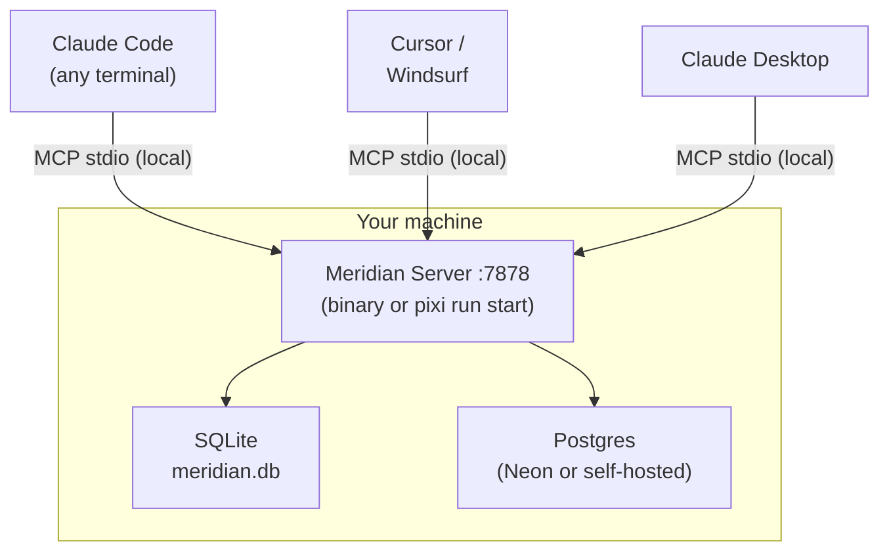
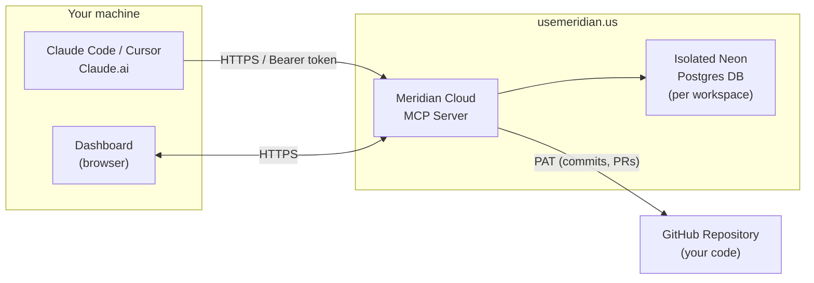
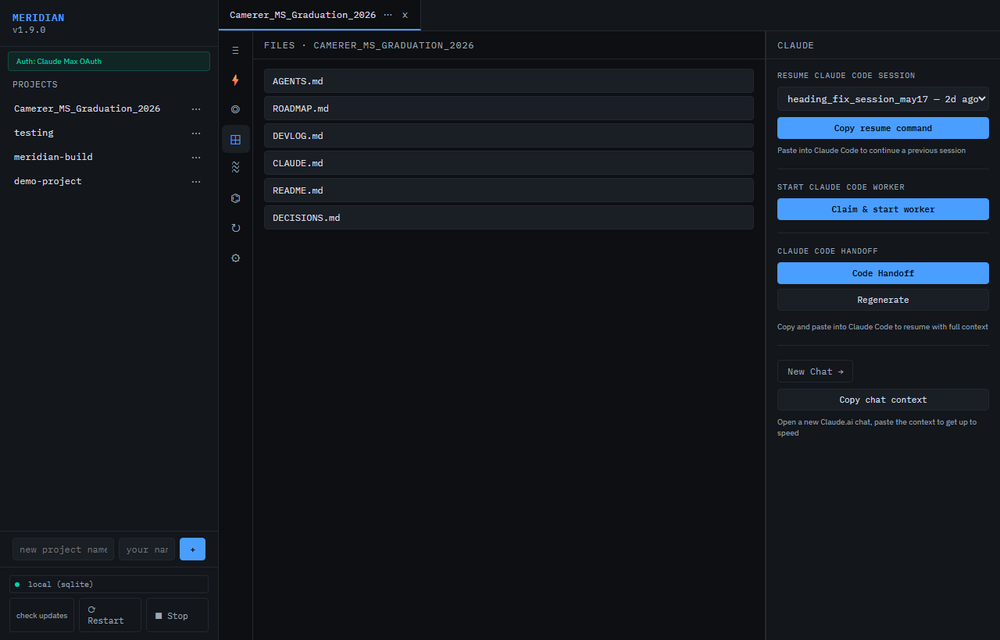

# Meridian

**Shared memory for your AI sessions.**

[](https://github.com/meridianmcp/Meridian)
[](https://github.com/meridianmcp/Meridian/blob/main/LICENSE)

---

## The Problem

Every AI coding session starts completely fresh. Open Claude Code in two terminals and they have absolutely no idea what the other is doing. Hit the context limit mid-task and your entire working memory evaporates. Run parallel sessions and they step on each other — duplicate work, conflicting edits, no coordination.

That third failure mode is file conflicts: parallel agents can edit the same high-contention files without knowing the other session already claimed the work.

This isn't a Claude problem. It's a fundamental limitation of stateless sessions. And it gets worse with every wasted token.


## The Solution

Meridian is a local MCP server that gives all your Claude sessions a **shared persistent brain**.


Every session that connects to Meridian can:

- **Claim files before editing** - parallel agents see active locks before they touch the same code

- **Read the current goal** — what the project is trying to accomplish right now
- **Log tasks** — what it's doing, what it finished, what failed
- **See every other session's work** — no duplicate effort
- **Generate instant handoffs** — compressed context files that resume a new session in seconds

When the context window fills up, you can generate a handoff and start fresh. The new session will then read the file and pick up exactly where you left off -- no re-explaining required.


## Running parallel agents safely

Meridian lets multiple AI sessions work at once without pretending merge conflicts do not exist. Each executor can call `claim_file(session_id, path)` before editing shared files, and new sessions see `file_warnings` from active file claims when they start.

For high-contention files, run sequentially instead of in parallel:

- `meridian/static/dashboard.js`
- `meridian/server.py`
- `meridian/db/__init__.py`

Sprint items can also carry a `touches_files` field so handoffs and dashboards can warn before an agent copies work that overlaps with an active session.

## Key Features

| Feature | What it does |
|---------|-------------|
| `start_session` | Register this session, load full context in one call |
| `get_goal` | Read the shared north star, sprint, and version goal |
| `log_task` | Log progress — all sessions see it instantly |
| `claim_task` | Lock a task so two sessions can't double-work it |
| `generate_handoff` | Compress full context into a resumable file |
| `get_sprint_items` | See the sprint board — what's todo, in progress, done |
| `set_goal` | Update the shared goal — all sessions align instantly |
| `get_sessions` | See all active sessions and their last activity |

## Architecture

Two deployment modes — pick the one that fits you.

### Self-hosted (free)



### Hosted tier (usemeridian.us)



Zero local install — sign in at [usemeridian.us](https://usemeridian.us), copy your API token, add to MCP config.

## Dashboard

### Video walkthrough

<video controls preload="metadata" width="100%" style="max-width:900px;border-radius:8px;margin:8px 0">
  <source src="/videos/meridian-using-demo.mp4" type="video/mp4">
  Your browser does not support embedded video. <a href="/videos/meridian-using-demo.mp4">Download the walkthrough</a>.
</video>




!!! info "HITL, in plain English"
    HITL means "human in the loop." When an AI session hits a risky choice or needs approval, it can pause and put a question in Meridian's queue so a person can answer it before work continues.

## Quick Install

=== "pixi (recommended)"
    ```bash
    git clone https://github.com/meridianmcp/Meridian
    cd Meridian
    pixi install
    pixi run start
    ```

=== "pip"
    ```bash
    git clone https://github.com/meridianmcp/Meridian
    cd Meridian
    pip install -e .
    python -m meridian
    ```

=== "Docker"
    ```bash
    git clone https://github.com/meridianmcp/Meridian
    cd Meridian
    docker compose up
    ```

Then add to your Claude Code `.mcp.json`:

```json
{
  "mcpServers": {
    "meridian": {
      "command": "pixi",
      "args": ["run", "python", "-m", "meridian", "--mcp"],
      "cwd": "/path/to/Meridian"
    }
  }
}
```

→ [Full quickstart guide](quickstart.md)

## Power Tools (Recommended Companions)

These MCP servers pair with Meridian to give your AI agents codebase context and safe file editing.

**Same JSON format everywhere — only the file path changes.**

=== "Claude Code"
    **File:** `.mcp.json` at project root (project-scoped), or `~/.config/claude/mcp.json` (global)

    ```json
    {
      "mcpServers": {
        "meridian": {
          "command": "pixi",
          "args": ["run", "python", "-m", "meridian", "--mcp"],
          "cwd": "/path/to/Meridian"
        },
        "text-editor": { "command": "uvx", "args": ["mcp-text-editor"] },
        "repomix": { "command": "npx", "args": ["-y", "repomix", "--mcp"] }
      }
    }
    ```

=== "Claude Desktop"
    **File:**

    - **macOS:** `~/Library/Application Support/Claude/claude_desktop_config.json`
    - **Windows:** `%APPDATA%\Claude\claude_desktop_config.json`

    ```json
    {
      "mcpServers": {
        "meridian": {
          "command": "pixi",
          "args": ["run", "python", "-m", "meridian", "--mcp"],
          "cwd": "/path/to/Meridian"
        },
        "text-editor": { "command": "uvx", "args": ["mcp-text-editor"] },
        "repomix": { "command": "npx", "args": ["-y", "repomix", "--mcp"] }
      }
    }
    ```

=== "Cursor"
    **File:** `.cursor/mcp.json` at project root

    ```json
    {
      "mcpServers": {
        "meridian": {
          "command": "pixi",
          "args": ["run", "python", "-m", "meridian", "--mcp"],
          "cwd": "/path/to/Meridian"
        },
        "text-editor": { "command": "uvx", "args": ["mcp-text-editor"] },
        "repomix": { "command": "npx", "args": ["-y", "repomix", "--mcp"] }
      }
    }
    ```

=== "Windsurf"
    **File:** `~/.codeium/windsurf/mcp_config.json`

    ```json
    {
      "mcpServers": {
        "meridian": {
          "command": "pixi",
          "args": ["run", "python", "-m", "meridian", "--mcp"],
          "cwd": "/path/to/Meridian"
        },
        "text-editor": { "command": "uvx", "args": ["mcp-text-editor"] },
        "repomix": { "command": "npx", "args": ["-y", "repomix", "--mcp"] }
      }
    }
    ```

=== "Browser clients"
    Hosted Meridian works directly in Claude and ChatGPT (alpha) without an extension.

    1. Open Claude **Customize > Connectors** or ChatGPT **Settings > Apps**
    2. Add `https://usemeridian.us/mcp`
    3. Complete OAuth in the browser

    **Claude** works natively with no configuration.
    **ChatGPT (alpha)** — requires Developer Mode; some tools are filtered by ChatGPT's safety layer. Official catalog submission pending.

    For self-hosted localhost setups, use a local Claude SSE bridge or expose
    Meridian on a public HTTPS URL first.

    -> [Full browser connector guide](browser-connector.md)

**What each adds:**

| Tool | What it does | Install |
|------|-------------|---------|
| [mcp-text-editor](https://github.com/tumf/mcp-text-editor) | Safe line-oriented file patching with conflict detection | `uvx mcp-text-editor` |
| [Repomix](https://repomix.com) | Packs your entire codebase into AI-friendly context | `npx repomix --mcp` |
| [Desktop Commander](https://github.com/wonderwhy-er/DesktopCommanderMCP) | Terminal, process management, file system | Already in submodule |


## Screenshots

The Meridian dashboard runs in your browser at `localhost:7878`. All data stays on your machine (or your dedicated Neon DB on the hosted tier).

<div style="display:grid;grid-template-columns:1fr 1fr;gap:12px;margin:16px 0">
  <div>
    <p><strong>Dashboard — project overview</strong></p>
    
  </div>
  <div>
    <p><strong>Live sessions tab</strong></p>
    
  </div>
  <div>
    <p><strong>Goal + sprint board</strong></p>
    
  </div>
  <div>
    <p><strong>Queue — task log</strong></p>
    
  </div>
</div>

Try the live demo at [usemeridian.us/demo](https://usemeridian.us/demo) — no sign-in needed.

## Hosted Tier

Don't want to run your own server? [usemeridian.us](https://usemeridian.us) is a hosted version — sign in with Google or GitHub, get a managed Neon Postgres database, and connect over HTTPS.

**Free $0 · Standard $20/month · Pro waitlist** — Free includes 0.5 CU / 10 CU-hrs total; Standard includes 2 CU / 50 CU-hrs/month and up to 20 members.

→ [Hosted tier guide](hosted.md)
