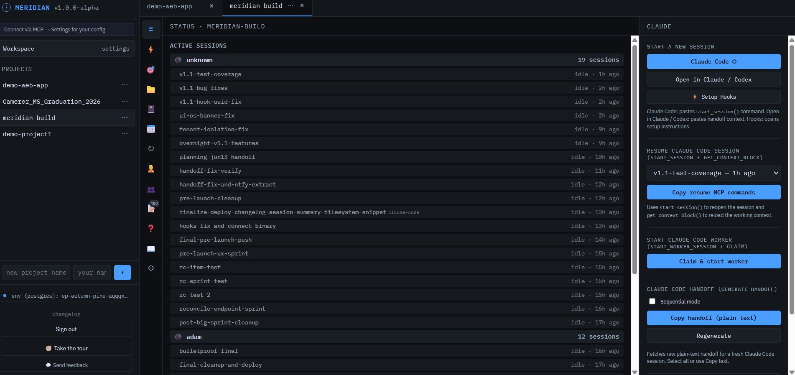
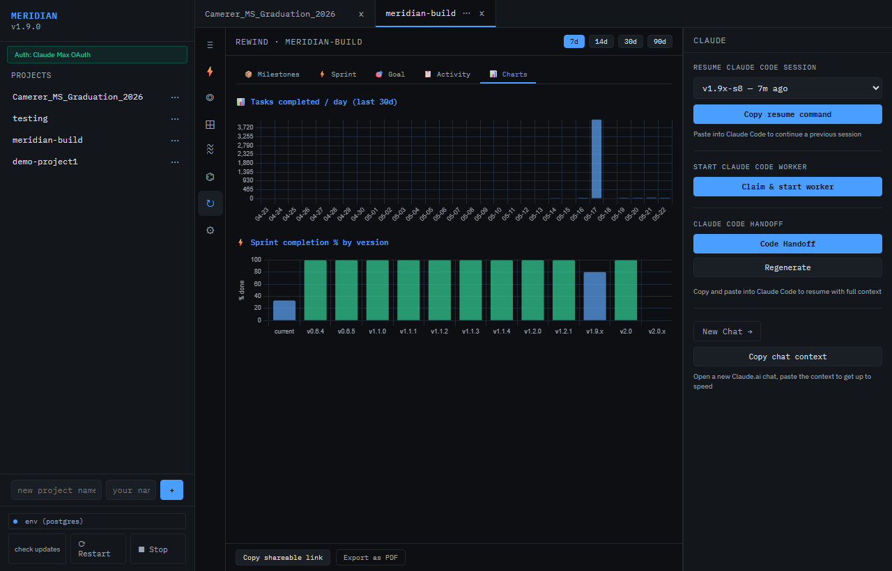
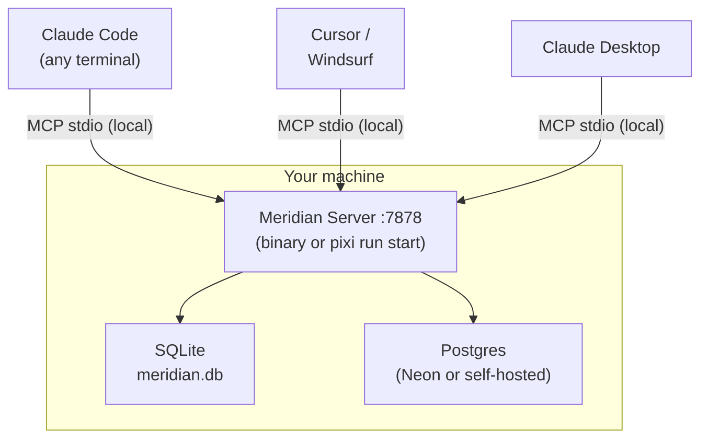
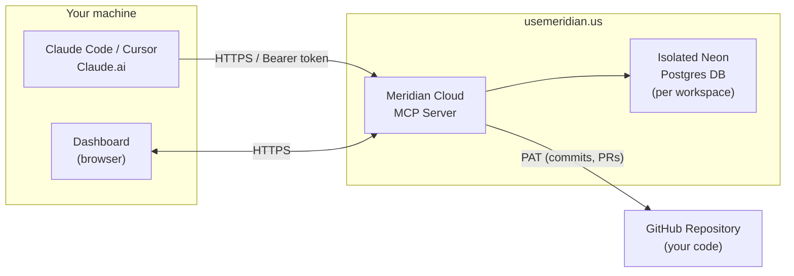

# Meridian

**Shared memory for your AI sessions.**

[](https://github.com/meridianmcp/Meridian)
[](https://github.com/meridianmcp/Meridian/blob/main/LICENSE)

---

## The Problem

Every AI coding session starts completely fresh. Open Claude Code in two terminals and they have absolutely no idea what the other is doing. Hit the context limit mid-task and your entire working memory evaporates. Run parallel sessions and they step on each other — duplicate work, conflicting edits, no coordination.

That third failure mode is file conflicts: parallel agents can edit the same high-contention files without knowing the other session already claimed the work.

This isn't a Claude problem. It's a fundamental limitation of stateless sessions. And it gets worse with every wasted token.

## The Solution

Meridian is a local MCP server that gives all your Claude sessions a **shared persistent brain**.



Every session that connects to Meridian can:

- **Claim files before editing** - parallel agents see active locks before they touch the same code

- **Read the current goal** — what the project is trying to accomplish right now
- **Log tasks** — what it's doing, what it finished, what failed
- **See every other session's work** — no duplicate effort
- **Generate instant handoffs** — compressed context files that resume a new session in seconds

When the context window fills up, you can generate a handoff and start fresh. The new session will then read the file and pick up exactly where you left off -- no re-explaining required.



## Running parallel agents safely

Meridian has two layers of parallel safety:

**Git worktrees (recommended)** — `claim_sprint_item` returns worktree setup commands by default. Each executor works in an isolated branch under `.claude/worktrees/{session}`, so parallel sessions never touch the same working tree. When the item is done, Meridian reminds the executor to merge before closing the worktree.

```bash
# Meridian returns this automatically when you claim a sprint item:
git worktree add .claude/worktrees/abc12345 -b worktree/item123
# ... do all work here ...
git checkout dev && git merge worktree/item123 --no-edit
git worktree remove .claude/worktrees/abc12345 --force
```

**File claims (lightweight alternative)** — for quick edits without a full worktree, call `claim_file(session_id, path)` before editing shared files. New sessions see `file_warnings` from active claims when they call `start_session`. Sprint items carry a `touches_files` field so the dashboard warns when planned work overlaps with a live session.

Both modes are configurable per-project in **Settings → Parallel Safety**.

## Key Features

| Tool | What it does |
|------|-------------|
| `start_session` | Register this session, load full context (goal, sprint, tasks, decisions) in one call |
| `log_task` | Log progress — all sessions see it instantly |
| `checkpoint` | Snapshot progress + generate delta handoff + return next `/goal` string |
| `pin_decision` | Add an architectural decision to the live shared constitution |
| `request_hitl` | Surface a blocking question to the human queue — with auto-answer modes |
| `claim_sprint_item` | Claim a sprint item; returns git worktree setup commands by default |
| `get_sprint_items` | See the sprint board — pending, in-progress, done |
| `pin_workspace_decision` | Cross-project decisions injected into every session's context |
| `get_commits` / `list_branches` | GitHub hub: read commits, branches, PRs, issues from connected repo |
| `generate_handoff` | Compress full context into a resumable file (also returned by `checkpoint`) |

## Architecture

Two deployment modes — pick the one that fits you.

### Self-hosted (free)



### Hosted tier (usemeridian.us)



Zero local install — sign in at [usemeridian.us](https://usemeridian.us), copy your API token, add to MCP config.

Curious exactly where your project data lives in each mode, and how to delete it? → [Data Handling](data-handling.md)

When a client shows an old or incomplete tool list, see [MCP tool-surface
freshness](mcp-tool-surface.md) for the cross-platform refresh contract and
client-specific recovery steps.

For the canonical producer/receiver workflow, token and body verification,
bounded scopes, and recovery rules, see the [Meridian handoff contract](meridian-handoff-contract.md).

## Dashboard

The Meridian dashboard runs at `localhost:7878` (self-hosted) or `usemeridian.us/dashboard` (hosted). All project data, session activity, and configuration lives here.


Key tabs:

- **Live** — active sessions, real-time task feed, HITL queue
- **Goal** — north star, sprint focus, version goal with per-field freshness indicators
- **Sprint** — sprint board (kanban-style), add/claim/complete items from the UI
- **Decisions** — live constitution: pinned architectural decisions shared across all sessions
- **Queue** — full task log across all sessions with search
- **Team** — session presence, human activity heatmap
- **HITL** — human-in-the-loop queue: answer or dismiss blocking questions from AI sessions
- **Rewind** — timeline of every goal change, task, and session event; charts tab with velocity data
- **Files** — edit AGENTS.md, ROADMAP.md, DEVLOG.md in-browser; GitHub hub (commits, branches, issues) for connected repos
- **Settings** — executor config, HITL auto-answer mode, parallel safety toggles, max decisions limit

!!! info "HITL, in plain English"
    HITL means "human in the loop." When an AI session hits a risky choice or needs approval, it can pause and put a question in Meridian's queue so a person can answer it before work continues. HITL supports auto-answer modes (Off / Safe / Aggressive) so routine executor questions don't block unattended runs.

## Quick Install

=== "pixi (recommended)"
    ```bash
    git clone https://github.com/meridianmcp/Meridian
    cd Meridian
    pixi install
    pixi run start
    ```

=== "pip"
    ```bash
    git clone https://github.com/meridianmcp/Meridian
    cd Meridian
    pip install -e .
    python -m meridian
    ```

=== "Docker"
    ```bash
    git clone https://github.com/meridianmcp/Meridian
    cd Meridian
    docker compose up
    ```

Then add to your Claude Code `.mcp.json`:

```json
{
  "mcpServers": {
    "meridian": {
      "command": "pixi",
      "args": ["run", "python", "-m", "meridian", "--mcp"],
      "cwd": "/path/to/Meridian"
    }
  }
}
```

→ [Full quickstart guide](quickstart.md)

## Power Tools (Recommended Companions)

These MCP servers pair with Meridian to give your AI agents codebase context and safe file editing.

**Same JSON format everywhere — only the file path changes.**

=== "Claude Code"
    **File:** `.mcp.json` at project root (project-scoped), or `~/.config/claude/mcp.json` (global)

    ```json
    {
      "mcpServers": {
        "meridian": {
          "command": "pixi",
          "args": ["run", "python", "-m", "meridian", "--mcp"],
          "cwd": "/path/to/Meridian"
        },
        "text-editor": { "command": "uvx", "args": ["mcp-text-editor"] },
        "repomix": { "command": "npx", "args": ["-y", "repomix", "--mcp"] }
      }
    }
    ```

=== "Claude Desktop"
    **File:**

    - **macOS:** `~/Library/Application Support/Claude/claude_desktop_config.json`
    - **Windows:** `%APPDATA%\Claude\claude_desktop_config.json`

    ```json
    {
      "mcpServers": {
        "meridian": {
          "command": "pixi",
          "args": ["run", "python", "-m", "meridian", "--mcp"],
          "cwd": "/path/to/Meridian"
        },
        "text-editor": { "command": "uvx", "args": ["mcp-text-editor"] },
        "repomix": { "command": "npx", "args": ["-y", "repomix", "--mcp"] }
      }
    }
    ```

=== "Cursor"
    **File:** `.cursor/mcp.json` at project root

    ```json
    {
      "mcpServers": {
        "meridian": {
          "command": "pixi",
          "args": ["run", "python", "-m", "meridian", "--mcp"],
          "cwd": "/path/to/Meridian"
        },
        "text-editor": { "command": "uvx", "args": ["mcp-text-editor"] },
        "repomix": { "command": "npx", "args": ["-y", "repomix", "--mcp"] }
      }
    }
    ```

=== "Windsurf"
    **File:** `~/.codeium/windsurf/mcp_config.json`

    ```json
    {
      "mcpServers": {
        "meridian": {
          "command": "pixi",
          "args": ["run", "python", "-m", "meridian", "--mcp"],
          "cwd": "/path/to/Meridian"
        },
        "text-editor": { "command": "uvx", "args": ["mcp-text-editor"] },
        "repomix": { "command": "npx", "args": ["-y", "repomix", "--mcp"] }
      }
    }
    ```

=== "Browser clients"
    Hosted Meridian works directly in Claude and ChatGPT (alpha) without an extension.

    1. Open Claude **Customize > Connectors** or ChatGPT **Settings > Apps**
    2. Add `https://usemeridian.us/mcp`
    3. Complete OAuth in the browser

    **Claude** works natively with no configuration.
    **ChatGPT (alpha)** — requires Developer Mode; some tools are filtered by ChatGPT's safety layer. Official catalog submission pending.

    For self-hosted localhost setups, use a local Claude SSE bridge or expose
    Meridian on a public HTTPS URL first.

    -> [Full browser connector guide](browser-connector.md)

**What each adds:**

| Tool | What it does | Install |
|------|-------------|---------|
| [mcp-text-editor](https://github.com/tumf/mcp-text-editor) | Safe line-oriented file patching with conflict detection | `uvx mcp-text-editor` |
| [Repomix](https://repomix.com) | Packs your entire codebase into AI-friendly context | `npx repomix --mcp` |
| [Desktop Commander](https://github.com/wonderwhy-er/DesktopCommanderMCP) | Terminal, process management, file system | Already in submodule |


## Screenshot

The Meridian dashboard runs in your browser at `localhost:7878`. All data stays on your machine (or your dedicated Neon DB on the hosted tier).


Try the live demo at [usemeridian.us/demo](https://usemeridian.us/demo) — no sign-in needed.

## Hosted Tier

Don't want to run your own server? [usemeridian.us](https://usemeridian.us) is a hosted version — sign in with Google or GitHub, get a managed Neon Postgres database, and connect over HTTPS.

**Free $0 · Standard $20/month · Pro waitlist** — Free includes 0.5 CU / 10 CU-hrs total; Standard includes 2 CU / 50 CU-hrs/month and up to 20 members.

→ [Hosted tier guide](hosted.md)
