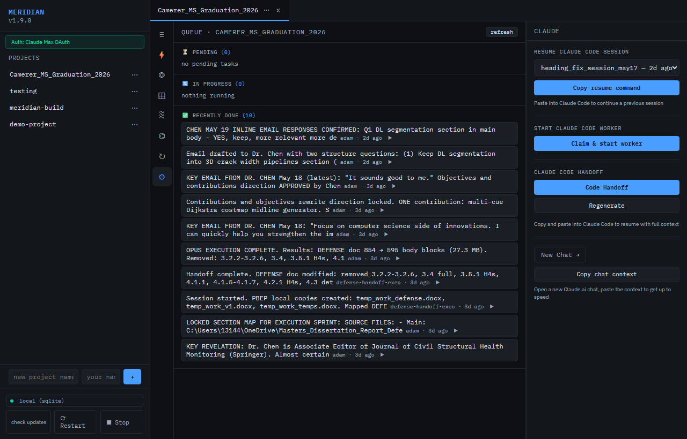

# Meridian

**Shared memory for your AI sessions.**

[](https://github.com/meridianmcp/Meridian)
[](https://github.com/meridianmcp/Meridian/blob/main/LICENSE)

---

## The Problem

Every AI coding session starts completely fresh. Open Claude Code in two terminals and they have absolutely no idea what the other is doing. Hit the context limit mid-task and your entire working memory evaporates. Run parallel sessions and they step on each other — duplicate work, conflicting edits, no coordination.

This isn't a Claude problem. It's a fundamental limitation of stateless sessions. And it gets worse with every wasted token.

## The Solution

Meridian is a local MCP server that gives all your Claude sessions a **shared persistent brain**.

Every session that connects to Meridian can:

- **Read the current goal** — what the project is trying to accomplish right now
- **Log tasks** — what it's doing, what it finished, what failed
- **See every other session's work** — no duplicate effort
- **Generate instant handoffs** — compressed context files that resume a new session in seconds

When the context window fills up, you can generate a handoff and start fresh. The new session will then read the file and pick up exactly where you left off -- no re-explaining required.

## Key Features

| Feature | What it does |
|---------|-------------|
| `start_session` | Register this session, load full context in one call |
| `get_goal` | Read the shared north star, sprint, and version goal |
| `log_task` | Log progress — all sessions see it instantly |
| `claim_task` | Lock a task so two sessions can't double-work it |
| `generate_handoff` | Compress full context into a resumable file |
| `get_sprint_items` | See the sprint board — what's todo, in progress, done |
| `set_goal` | Update the shared goal — all sessions align instantly |
| `get_sessions` | See all active sessions and their last activity |

## Architecture

Two deployment modes — pick the one that fits you.

### Self-hosted (free)

```
┌─────────────────────────────────────────────────────────────┐
│                        Your machine                         │
│                                                             │
│  ┌─────────────┐  ┌─────────────┐  ┌─────────────────────┐ │
│  │ Claude Code │  │   Cursor /  │  │  Claude Desktop     │ │
│  │  (any term) │  │  Windsurf   │  │  (via .dxt install) │ │
│  └──────┬──────┘  └──────┬──────┘  └──────────┬──────────┘ │
│         │                │                    │            │
│         └────────────────┴────────────────────┘            │
│                          │ MCP stdio (local)               │
│                   ┌──────▼──────┐                          │
│                   │  Meridian   │  ← pixi run start        │
│                   │ MCP Server  │    or binary .exe / mac  │
│                   │   :7878     │                          │
│                   └──────┬──────┘                          │
│                          │                                 │
│            ┌─────────────┴──────────────┐                  │
│            ▼                            ▼                  │
│   ┌────────────────┐        ┌─────────────────────┐        │
│   │   SQLite DB    │   or   │  Postgres (Neon /   │        │
│   │  meridian.db   │        │  any compatible DB) │        │
│   └────────────────┘        └─────────────────────┘        │
│                                                             │
│  Features: persistent memory · task log · sprint board     │
│            HITL queue · handoff · hooks auto-checkpoint     │
└─────────────────────────────────────────────────────────────┘
```

### Hosted tier (usemeridian.us)

```
┌──────────────────────┐         ┌───────────────────────────┐
│     Your machine     │         │    usemeridian.us cloud   │
│                      │         │                           │
│  ┌────────────────┐  │  HTTPS  │  ┌─────────────────────┐  │
│  │  Claude Code   │  │ Bearer  │  │  Meridian Cloud     │  │
│  │  Cursor        ├──┼────────►│  │  MCP Server         │  │
│  │  Claude.ai     │  │  token  │  └──────────┬──────────┘  │
│  └────────────────┘  │         │             │             │
│                      │         │  ┌──────────▼──────────┐  │
│  ┌────────────────┐  │         │  │ Isolated Neon       │  │
│  │  Dashboard     │◄─┼────────►│  │ Postgres DB         │  │
│  │  (browser)     │  │         │  │ (per workspace)     │  │
│  └────────────────┘  │         │  └─────────────────────┘  │
└──────────────────────┘         │                           │
                                 │  Features: same as self-  │
                                 │  hosted + zero install,   │
                                 │  managed DB, team URLs,   │
                                 │  SLA, SSO (enterprise)    │
                                 └───────────────────────────┘
```

Zero local install — sign in at [usemeridian.us](https://usemeridian.us), copy your API token, add to MCP config.

## Quick Install

=== "pixi (recommended)"
    ```bash
    git clone https://github.com/meridianmcp/Meridian
    cd Meridian
    pixi install
    pixi run start
    ```

=== "pip"
    ```bash
    git clone https://github.com/meridianmcp/Meridian
    cd Meridian
    pip install -e .
    python -m meridian
    ```

=== "Docker"
    ```bash
    git clone https://github.com/meridianmcp/Meridian
    cd Meridian
    docker compose up
    ```

Then add to your Claude Code `.mcp.json`:

```json
{
  "mcpServers": {
    "meridian": {
      "command": "pixi",
      "args": ["run", "python", "-m", "meridian", "--mcp"],
      "cwd": "/path/to/Meridian"
    }
  }
}
```

→ [Full quickstart guide](quickstart.md)

## Power Tools (Recommended Companions)

These MCP servers pair with Meridian to give your AI agents codebase context and safe file editing. Add them alongside Meridian in your MCP config:

=== "Claude Code (.mcp.json)"
    ```json
    {
      "mcpServers": {
        "meridian": {
          "command": "pixi",
          "args": ["run", "python", "-m", "meridian", "--mcp"],
          "cwd": "/path/to/Meridian"
        },
        "text-editor": {
          "command": "uvx",
          "args": ["mcp-text-editor"]
        },
        "repomix": {
          "command": "npx",
          "args": ["-y", "repomix", "--mcp"]
        }
      }
    }
    ```

=== "Claude Desktop"
    ```json
    {
      "mcpServers": {
        "meridian": {
          "command": "pixi",
          "args": ["run", "python", "-m", "meridian", "--mcp"],
          "cwd": "/path/to/Meridian"
        },
        "text-editor": {
          "command": "uvx",
          "args": ["mcp-text-editor"]
        },
        "repomix": {
          "command": "npx",
          "args": ["-y", "repomix", "--mcp"]
        }
      }
    }
    ```

**What each adds:**

| Tool | What it does | Install |
|------|-------------|---------|
| [mcp-text-editor](https://github.com/tumf/mcp-text-editor) | Safe line-oriented file patching with conflict detection | `uvx mcp-text-editor` |
| [Repomix](https://repomix.com) | Packs your entire codebase into AI-friendly context | `npx repomix --mcp` |
| [Desktop Commander](https://github.com/wonderwhy-er/DesktopCommanderMCP) | Terminal, process management, file system | Already in submodule |


## Screenshots

The Meridian dashboard runs in your browser at `localhost:7878`. All data stays on your machine (or your dedicated Neon DB on the hosted tier).

<div style="display:grid;grid-template-columns:1fr 1fr;gap:12px;margin:16px 0">
  <div>
    <p><strong>Dashboard — project overview</strong></p>
    
  </div>
  <div>
    <p><strong>Live sessions tab</strong></p>
    
  </div>
  <div>
    <p><strong>Goal + sprint board</strong></p>
    
  </div>
  <div>
    <p><strong>Queue — task log</strong></p>
    
  </div>
</div>

Try the live demo at [usemeridian.us/demo](https://usemeridian.us/demo) — no sign-in needed.

## Hosted Tier

Don't want to run your own server? [usemeridian.us](https://usemeridian.us) is a hosted version — sign in with Google or GitHub, get a managed Neon Postgres database, and connect over HTTPS.

**$20/month** — 7-day free trial, no commitment.

→ [Hosted tier guide](hosted.md)
